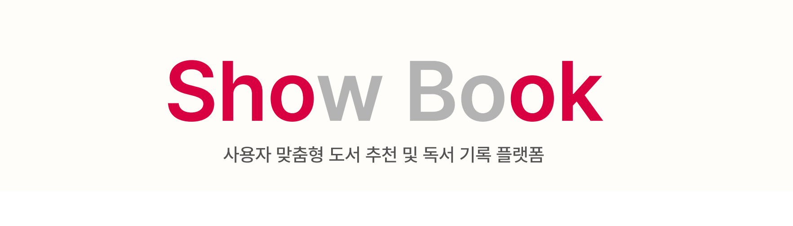

  <h1>독서 추천/흥미 유도 플랫폼</h1>

## 기획 의도

본 프로젝트는 책을 읽고싶어하는 사람들의 **독서에 대한 흥미를 유도**하고자 기획되었습니다.  
사용자의 취향을 분석하여 개인 맞춤형 도서를 추천함으로써, 독서에 대한 관심을 높이고 독서 문화를 활성화하려는 목적을 가지고 있습니다.

## 프로젝트 구조

- main: 프로젝트의 메인 브랜치로, 현재 산출물 및 기타 파일들이 등록되어 있습니다.
- front: 프론트엔드 개발을 위한 브랜치입니다. 사용자 인터페이스 디자인, 클라이언트 사이드 로직, 프론트엔드 관련 기술 스택의 개발이 이 브랜치에서 진행됩니다.
- back: 백엔드 개발을 위한 브랜치입니다.서버 사이드 로직, 데이터베이스 관리, API 개발 등 백엔드 관련 작업이 이 브랜치에서 이루어집니다.
- ML: ML 기능 개발을 위한 브랜치입니다. 데이터 크롤링, 전처리, 추천 모델 학습 및 성능 평가, 그리고 Flask를 통한 API 개발 등 ML 관련 작업이 이 브랜치에서 진행됩니다.

## 기술 스택
    
 
   
 
   
 
    
 
  
 

## 서비스 플로우

## 시스템 아키텍처

## ERD

## 메인 기능

- **책 추천**: 취향 분석을 통한 사용자 맞춤형 도서 추천
- **슈욱**: 숏폼 형태의 후기 작성 기능
  - 이미지 안의 키워드의 빈도를 통해 사용자 맞춤 숏폼 제공
- **서재**: 도서 목록 관리
- **마이페이지**: 개인의 독서현황을 시각적으로 확인

## 세부 사항

- 회원 가입 시, 사용자 설문 기반 + 크롤링한 책 데이터 기반으로 추천
- 독서 현황 기록
- 슈욱을 통해 독서에 대한 흥미 유도 및 공유

## 추천 시스템 구축 과정

### 데이터 수집

**교보문고 웹사이트로부터 약 1만 2천 여개의 도서 데이터 수집**
- 책 제목, 책 소개, 저자, 페이지 수, 출판사, 책 사진
- 파이썬 Request, Selenium 라이브러리를 활용

### 데이터 전처리
- 띄어쓰기, 맞춤법 검사
- 정규 표현식을 활용하여 한글, 공백 이외 문자 제거
- 토큰화(Okt, MeCab)
- 불용어 처리

### 모델 학습

1. **워드 임베딩**
   - `책 설명(description)` → 벡터화
   - Word2Vec, **FastText**
     - 사전학습모델 사용, Word2Vec에 비해 좋은 성능
     - 하지만 모델 용량이 큰 관계로 경량화 예정
       - Vector Size : 300 → 100
   - 임베딩된 단어들을 바탕으로 단어 벡터 생성
   - 이들의 평균을 문서 벡터화
2. **유사도 계산**
   - 코사인 유사도 → 책 간의 유사도 측정
   - 유사도가 높은 상위 5개의 책을 추천

### 모델 서빙
- 학습된 모델을 Flask 서버에 서빙
- 사용자 선호 카테고리/서재에 저장된 책을 바탕 유사한 책 추천